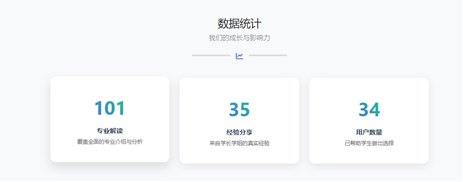

简体中文

<div align="center">
  <h3 align="center">启航专业志</h3>
  <p align="center">
    为高考生提供全面的专业信息和真实的经验分享平台，帮助学生科学理性地选择专业。
    <br />
    <a href="#关于本项目"><strong>浏览文档 »</strong></a>
    <br />
    <br />
    <a href="#使用方法">查看 Demo</a>
  </p>
</div>

---

<div align="center">
  
  <br><br>
  
  <br><br>
  
  <br><br>
  
  <br><br>
  
  <br><br>
  
  <br><br>
  
  <br><br>
  
  <br><br>
  
</div>


<details>
  <summary>目录</summary>
  <ol>
    <li><a href="#关于本项目">关于本项目</a></li>
    <li><a href="#构建工具">构建工具</a></li>
    <li><a href="#技术架构">技术架构</a></li>
    <li><a href="#作品特色">作品特色</a></li>
    <li><a href="#安装">安装</a></li>
    <li><a href="#使用方法">使用方法</a></li>
    <li><a href="#数据库说明">数据库说明</a></li>
    <li><a href="#文件目录说明">文件目录说明</a></li>
    <li><a href="#运行环境">运行环境</a></li>
  </ol>
</details>

## 关于本项目

《启航专业志》致力于为高考生提供全面的专业信息和真实的经验分享，结合"知途"专业解读与"学途说"互动交流，帮助学生科学理性地选择专业，缓解信息不对称，提升志愿填报的准确性与决策信心。

**主要功能：**
- 专业信息查询：提供全面的专业解读和详细信息
- 用户交流论坛：支持学长学姐经验分享和互动交流
- 专业推荐轮播：展示热门专业和推荐专业信息
- 用户账户管理：支持用户注册、登录和个人信息管理
- 数据动态展示：实时统计与用户信息展示

<p align="right">(<a href="#top">返回顶部</a>)</p>

## 构建工具

- [Node.js](https://nodejs.org/)
- [Express](https://expressjs.com/)
- [MySQL](https://www.mysql.com/)
- [Bootstrap 5](https://getbootstrap.com/)
- [Swiper](https://swiperjs.com/)
- [Animate.css](https://animate.style/)
- [Python](https://www.python.org/)

<p align="right">(<a href="#top">返回顶部</a>)</p>

## 技术架构

平台采用现代化的前后端分离架构，具体技术栈如下：

- 前端技术：
  - HTML5、CSS3和原生JavaScript构建网页结构与交互逻辑
  - Bootstrap 5框架实现响应式布局，适配多终端设备
  - Swiper库实现首页专业推荐轮播图，提供3D卡片效果
  - Animate.css库实现页面元素的动画效果，提升视觉体验

- 后端技术：
  - Node.js和Express框架构建Web服务器
  - MySQL数据库存储与查询专业、用户与帖子信息
  - RESTful API接口，用于前后端数据通信
  - express-session与cookie-parser管理用户会话与身份认证
  - MVC架构：分离数据访问、业务逻辑与路由处理

- 数据来源：
  - Python爬虫程序，自动抓取阳光高考网专业数据
  - BeautifulSoup解析HTML页面，提取有效信息
  - mysql.connector库将数据自动写入MySQL数据库

<p align="right">(<a href="#top">返回顶部</a>)</p>

## 作品特色

1. **美观的卡片式专业展示**：结合Swiper实现炫酷的3D推荐轮播图，提升视觉吸引力
2. **丰富的动画过渡效果**：使用Animate.css使页面动效更自然、流畅
3. **响应式网页设计**：保证在手机、平板、PC等设备上的良好浏览体验
4. **数据动态驱动展示**：结合数据库读写、REST API与前端交互，展示实时统计与用户信息
5. **专业解读与论坛互动结合**：通过权威详实的专业解读与真实温暖的论坛交流双重支持，打造信息与经验并重的平台环境

<p align="right">(<a href="#top">返回顶部</a>)</p>

##安装

1. 克隆本仓库
   ```sh
   git clone https://github.com/yourusername/qihangzhuanyezhi.git
   ```

2. 运行服务器
   ```sh
   node serve.js
   ```

3. 配置数据库
   ```sh
   # 创建数据库
   mysql -u root -p
   ```

4. 访问链接
   ```
   http://localhost:3000

   ```

<p align="right">(<a href="#top">返回顶部</a>)</p>

## 使用方法

1. 在浏览器中访问 `http://localhost:3000` 进入网站首页
2. 注册账号并登录系统
3. 浏览专业信息，查看详细解读
4. 在论坛中与其他用户交流，分享经验

<p align="right">(<a href="#top">返回顶部</a>)</p>

## 数据库说明

本项目后端使用 **MySQL** 作为主要数据库，建议版本为 MySQL 8.x。

- **数据库配置**：
  ```
  host = 'localhost'
  user = 'root'
  password = '123456'
  database = 'majors_db'
  charset = 'utf8mb4'
  ```

- **主要数据表**：
  - `majors`：存储专业基本信息
  - `users`：用户账户信息
  - `forum_posts`：论坛帖子内容
  - `major_categories`：专业类别及其category_id

<p align="right">(<a href="#top">返回顶部</a>)</p>


## 文件目录说明

- `爬虫`：用于爬取阳光高考网（https://gaokao.chsi.com.cn/zyk/zybk/zyjd/listPage）的页面的信息
   - `专业解读汇总 100个专业集中登台 引领考生填报志愿_阳光高考信息平台.html` ：爬取的页面,页面中包含100个专业解读页面的url
   - `major_crawler_auto.py`：爬取专业信息并自动导入数据库
   - `专业数据` 中包含100个专业的解读页面的所有信息 (由于页面的信息结构不相同，不妨方便于提取，故本项目并没有渲染这些信息，而是在数据库中存储每个专业的url，然后采用与官网相同的方式跳转对应的专业解读页面)
- `css`: 层叠样式表
   - `common.css` ：通用样式
   - ` forum.css`：学途说页面样式
   - `majors.css` : 知途页面样式
   - `style.css`: 主页样式表
   - `user-dropdown.css` 顶部导航栏下拉框样式 
- `database` : 数据库 + 使用python将数据导入数据库中
- `images` 图片
- `js` ：JavaScript
   - `forum.js` ：学途说页面的JavaScript
   - `nav-active.js` 导航栏的JavaScript
   - `main.js` ：主页的JavaScript
   - `user-session.js` 用户会员管理的JavaScript
- `lib` ：第三方库
   - `bootstrap` ：bootstrap.bundle.min.css,bootstrap.bundle.min.js
   - `swiper` ：swiper-bundle.min.css,swiper-bundle.js
   - `animate.css` ：animate.min.css
   - `fontawesome` ：all.min.css
- `forum.html` 学途说页面
- `index.html` 主页
- `login.html` 登录页面
- `majors.html` 知途页面
- `server.js` 服务器
<p align="right">(<a href="#top">返回顶部</a>)</p>

## 运行环境

### 前端环境
- 核心技术：HTML5、CSS3、JavaScript
- 样式框架：Bootstrap 5 (版本5.0.2)
- 轮播图插件：Swiper 11.0.5
- 动画效果库：Animate.css 4.1.1

### 后端环境
- Node.js 版本：v20.19.0
- 主要依赖包：
  - express: ^5.1.0
  - mysql2: ^3.14.1
  - express-session: ^1.18.1
  - cookie-parser: ^1.4.7
- 数据库系统：MySQL 8.x

### 数据处理环境
- Python 版本：>=3.11.5
- 主要使用的库：
  - requests：版本2.32.3
  - beautifulsoup4：版本4.12.3
  - mysql.connector：版本9.3.0

### 开发与部署工具
- 代码编辑器：Visual Studio Code
- 数据库管理工具：Dbeaver, MySQL
- 接口调试工具：Postman
- 版本控制工具：Git

<p align="right">(<a href="#top">返回顶部</a>)</p>

