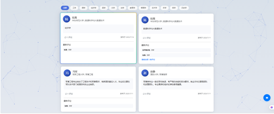

简体中文

<div align="center">
  <h3 align="center">启航专业志</h3>
  <p align="center">
    为高考生提供全面的专业信息和真实的经验分享平台，帮助学生科学理性地选择专业。
    <br />
    <a href="#关于本项目"><strong>浏览文档 »</strong></a>
    <br />
    <br />
    <a href="#使用方法">查看 Demo</a>
  </p>
</div>

---


<div class="sidebar">
  <div class="toc">
    <h3>目录</h3>
    <ol>
      <li><a href="#关于本项目">关于本项目</a></li>
      <li><a href="#构建工具">构建工具</a></li>
      <li><a href="#技术架构">技术架构</a></li>
      <li><a href="#关键技术">关键技术</a></li>
      <li><a href="#作品特色">作品特色</a></li>
      <li><a href="#使用方法">使用方法</a></li>
      <li><a href="#数据库说明">数据库说明</a></li>
      <li><a href="#文件目录说明">文件目录说明</a></li>
      <li><a href="#运行环境">运行环境</a></li>
      <li><a href="#界面截图">界面截图</a></li>
    </ol>
  </div>
</div>


## 关于本项目

《启航专业志》致力于为高考生提供全面的专业信息和真实的经验分享，结合"知途"专业解读与"学途说"互动交流，帮助学生科学理性地选择专业，缓解信息不对称，提升志愿填报的准确性与决策信心。

**主要功能：**
- 专业信息查询：提供全面的专业解读和详细信息
- 用户交流论坛：支持学长学姐经验分享和互动交流
- 专业推荐轮播：展示热门专业和推荐专业信息
- 用户账户管理：支持用户注册、登录和个人信息管理
- 数据动态展示：实时统计与用户信息展示

<p align="right">(<a href="#top">返回顶部</a>)</p>

## 构建工具

- [Node.js](https://nodejs.org/)
- [Express](https://expressjs.com/)
- [MySQL](https://www.mysql.com/)
- [Bootstrap 5](https://getbootstrap.com/)
- [Swiper](https://swiperjs.com/)
- [Animate.css](https://animate.style/)
- [Python](https://www.python.org/)

<p align="right">(<a href="#top">返回顶部</a>)</p>

## 技术架构

平台采用现代化的前后端分离架构，具体技术栈如下：

- 前端技术：
  - 使用HTML5、CSS3和原生JavaScript构建网页结构与交互逻辑。
  - 采用Bootstrap 5框架实现轮播图框架以及响应式布局，适配多终端设备。
  - 使用Swiper库实现首页专业推荐轮播图，提供3D卡片效果、自动轮播、导航按钮和触摸滑动功能
  - 使用Animate.css库实现页面元素的动画效果，如淡入淡出、滑动等，提升视觉体验。
  - 集成 Particles.js 库，添加网页的动态粒子背景。
  - 使用 marked.js 解析 AI 返回的 Markdown 文本，实现文本合适的渲染与展示。


- 后端技术：
  - 使用Node.js和Express框架构建Web服务器
  - 使用 MySQL 数据库 存储与查询专业、用户与帖子信息。
  - 实现RESTful API风格接口，用于前后端数据通信，实现专业查询、用户认证、论坛帖子管理等功能
  - 引入 express-session 与 cookie-parser 管理用户会话与身份认证。
  - 使用 axios 模块向 DeepSeek API 发送 HTTP 请求，实现 AI 聊天模块的后端消息转发与响应逻辑，支持用户与 AI 之间的实时对话功能。
  - 后端遵循 MVC 架构：分离数据访问、业务逻辑与路由处理，提升代码可维护性。


- 数据来源：
  - Python爬虫程序，使用requests库进行网络请求，BeautifulSoup进行HTML解析抓取了自动抓取阳光高考网专业数据；
  - mysql.connector库将数据自动写入MySQL数据库

<p align="right">(<a href="#top">返回顶部</a>)</p>

## 关键技术
1.	Node.js + Express 框架：构建后端服务，提供 RESTful 风格 API，支持用户注册 / 登录、专业数据查询、论坛发帖 / 评论、AI 交互等核心功能，处理前端请求与数据库交互。
2.	MySQL 数据库系统：用于存储专业信息、用户账户与论坛等内容，通过 JOIN 操作关联表数据，支持结构化查询与动态交互。
3.	Python 网络爬虫技术：利用requests与BeautifulSoup库从阳光高考网自动抓取专业信息，并通过mysql.connector模块将数据从 CSV 导入数据库，确保数据权威性与完整性。
4.	多种前端动效与视觉增强技术整合：通过 Swiper.js 实现首页动态轮播图与 3D 卡片效果，结合 Animate.css 提供自然流畅的页面过渡动画，并引入 Particles.js 构建科技感十足的粒子背景，整体提升网站的交互体验与视觉表现力。
5.	AI 聊天功能集成：前端构建 UI 界面，支持消息发送与 Markdown 渲染，通过 localStorage 存储聊天记录；使用 axios 发送 HTTP 请求到 DeepSeek API，实现连续对话与上下文保持，提供智能交互体验

<p align="right">(<a href="#top">返回顶部</a>)</p>

## 作品特色

1.	**丰富的视觉与交互体验**：结合 Swiper.js 构建首页 3D 卡片式轮播图，搭配 Animate.css 实现页面的自然过渡与元素动效，同时引入粒子背景动效，整体营造出现代感强烈、视觉层次丰富的浏览环境。
2.	**AI 智能问答模块**：AI 聊天窗口支持本地存储聊天记录与 Markdown 渲染，实现连续对话与清晰展示，为用户提供个性化的专业咨询与志愿决策辅助。
3.	**动态数据可视化呈现**：结合 MySQL 数据库与 REST API 实时读取用户、专业、论坛等信息，实现动态更新与交互反馈。
4.	**多维内容生态融合**：整合权威专业数据（源自阳光高考网）、学长学姐经验分享（“学途说” 模块）、论坛互动（发帖与评论），构建 “查询 - 参考 - 交流” 一体化的志愿规划平台，兼顾信息权威性与社区温度。


<p align="right">(<a href="#top">返回顶部</a>)</p>


## 使用方法

1. 终端中进入该项目目录,然后运行npm install 自动安装 package.json 中声明的所有模块
2. 通过database中的sql文件创建配置和创建数据库
3. 命令行输入node.js server.js运行服务器,在浏览器中访问 `http://localhost:3000` 进入网站首页
4. 注册账号并登录系统

<p align="right">(<a href="#top">返回顶部</a>)</p>

## 数据库说明

本项目后端使用 **MySQL** 作为主要数据库，建议版本为 MySQL 8.x。

- **数据库配置**：
  ```
  host = 'localhost'
  user = 'root'
  password = '123456'
  database = 'majors_db'
  charset = 'utf8mb4'
  ```

- **主要数据表**：
  - `majors`：存储专业基本信息
     - `major_id`：专业ID
     - `category_id`：专业类别ID
     - `major_name`：专业名称
     - `summary`: 专业简介
     - `source_url` ：专业详情链接
     - `create_at` ：创建时间
     - `update_at` ：更新时间
  - `users`：用户账户信息
     - `user_id`：用户ID
     - `nick_name`：用户昵称
     - `school`：学校名称
     - `major`: 专业名称
     - `education` ：学历
     - `username`: 账号
     - `password`: 密码
     - `created_at` ：创建时间
  - `forum_posts`：论坛帖子内容
     - `user_id`: 用户ID
     - `post_id`：帖子ID
     - `name`：用户昵称
     - `school`：学校名称
     - `major`: 专业名称
     - `category_id`：专业类别ID
     - `post_time`：发布时间
     - `content`: 帖子内容
     - `comments`: 评论内容
  - `major_categories`：
     - `category_id`：专业类别ID
     - `category_name`：专业类别名称
     - `description` ：专业类别描述
     - `create_at` ：创建时间
     - `update_at` ：更新时间

<p align="right">(<a href="#top">返回顶部</a>)</p>


## 文件目录说明

- `爬虫`：用于爬取阳光高考网（https://gaokao.chsi.com.cn/zyk/zybk/zyjd/listPage）的页面的信息
   - `专业解读汇总 100个专业集中登台 引领考生填报志愿_阳光高考信息平台.html` ：爬取的页面,页面中包含100个专业解读页面的url
   - `major_crawler_auto.py`：爬取专业信息并自动导入数据库
   - `专业数据` 中包含100个专业的解读页面的所有信息 (由于页面的信息结构不相同，不妨方便于提取，故本项目并没有渲染这些信息，而是在数据库中存储每个专业的url，然后采用与官网相同的方式跳转对应的专业解读页面)
- `css`: 层叠样式表
   - `ai-chat.css` ：AI聊天页面样式
   - `common.css` ：通用样式
   - `custom-icons`: 常用图标样式
   - `forum.css`：学途说页面样式
   - `login.css` ：登录页面样式
   - `major-categories.css` ：主页专业类别卡片样式 
   - `particles.css` ：粒子效果样式
   - `password-control.css` ：登入注册密码控制样式
   - `majors.css` : 知途页面样式
   - `style.css`: 主页样式表
   - `user-dropdown.css` 顶部导航栏下拉框样式 
- `database` : 数据库创建命令 + 使用python将数据导入数据库中
- `images` 图片
- `js` ：

   - `ai-chat.js` ：AI聊天页面的JavaScript
   - `forum.js` ：学途说页面的JavaScript
   - `nav-active.js` 导航栏的JavaScript
   - `partilces-config.js` ：粒子效果配置的JavaScript
   - `main.js` ：主页的JavaScript
   - `user-session.js` 用户会员管理的JavaScript
- `lib` ：第三方库
   - `bootstrap` ：bootstrap.bundle.min.css,bootstrap.bundle.min.js
   - `swiper` ：swiper-bundle.min.css,swiper-bundle.js
   - `animate.css` ：animate.min.css
   - `fontawesome` ：all.min.css
   - `particles`: particles.min.js
- `forum.html` 学途说页面
- `index.html` 主页
- `login.html` 登录页面
- `majors.html` 知途页面
- `server.js` 服务器
<p align="right">(<a href="#top">返回顶部</a>)</p>

## 运行环境

### 前端环境
- 核心技术：HTML5、CSS3、JavaScript
- 样式框架：Bootstrap 5 (版本5.0.2)
- 轮播图插件：Swiper 11.0.5
- 动画效果库：Animate.css 4.1.1
- 粒子特效库: particles 2.0.0 

### 后端环境
- Node.js 版本：v20.19.0
- 主要依赖包：
  - axios ^1.10.0 
  - express: ^5.1.0
  - mysql2: ^3.14.1
  - express-session: ^1.18.1
  - cookie-parser: ^1.4.7
- 数据库系统：MySQL 8.x

### 数据处理环境
- Python 版本：>=3.11.5
- 主要使用的库：
  - requests：版本2.32.3
  - beautifulsoup4：版本4.12.3
  - mysql.connector：版本9.3.0

### 开发与部署工具
- 代码编辑器：Visual Studio Code
- 数据库管理工具：Dbeaver, MySQL
- 接口调试工具：Postman
- 版本控制工具：Git

<p align="right">(<a href="#top">返回顶部</a>)</p>

## 界面截图
<div align="center">
  
  <br><br>
  
  <br><br>
  
  <br><br>
  
  <br><br>
  
  <br><br>
  
  <br><br>
  
  <br><br>
  
  <br><br>
  
  <br><br>
  
</div>

<p align="right">(<a href="#top">返回顶部</a>)</p>
